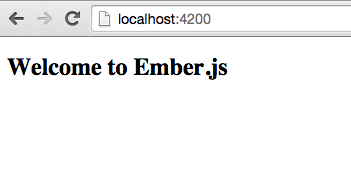
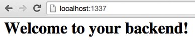

# Installation and Quickstart

```bash
$ npm install -g sails sane-cli

$ sane new project && cd project

$ sane up
```

## Open up your browser and visit localhost:4200  
If everything is working you should see:




## Now Visit localhost:1337
If everything is working you should see:



To work on your front-end app work as you would normally with ember-cli.

## Using Docker

To use docker pass the `--docker` flag when creating your new sane project

```bash
$ sane new project --docker
```

To setup an existing app to use docker you will need to change the setting in your `.sane-cli` file.

!FILENAME .sane-cli
```json:
"docker": false,
```

**Note:** If you use docker, make sure you have compose installed. 

On OSX or Windows you will also need `boot2docker`. 

Linux users see: https://docs.docker.com/installation/ubuntulinux/